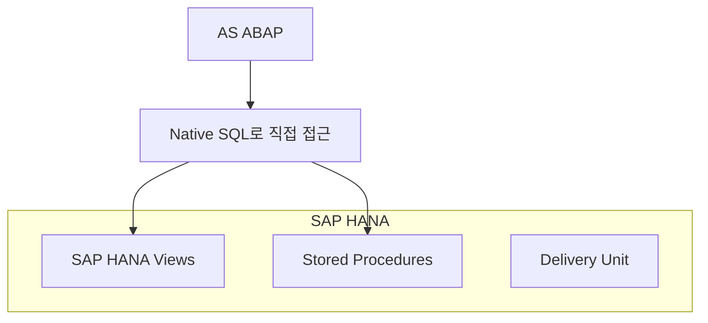
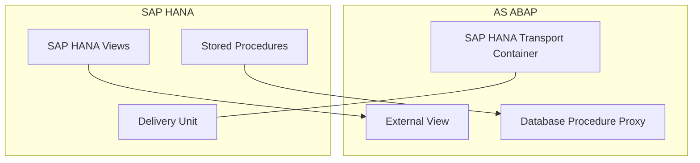
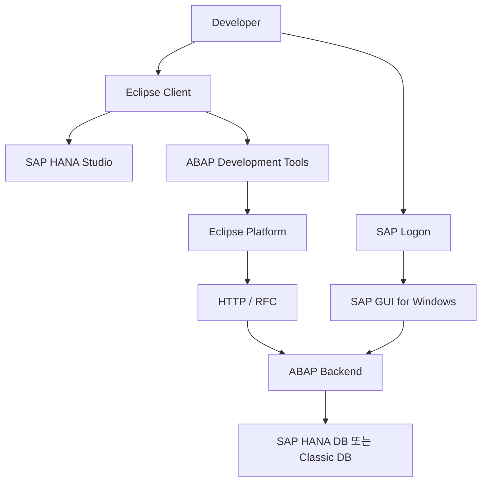
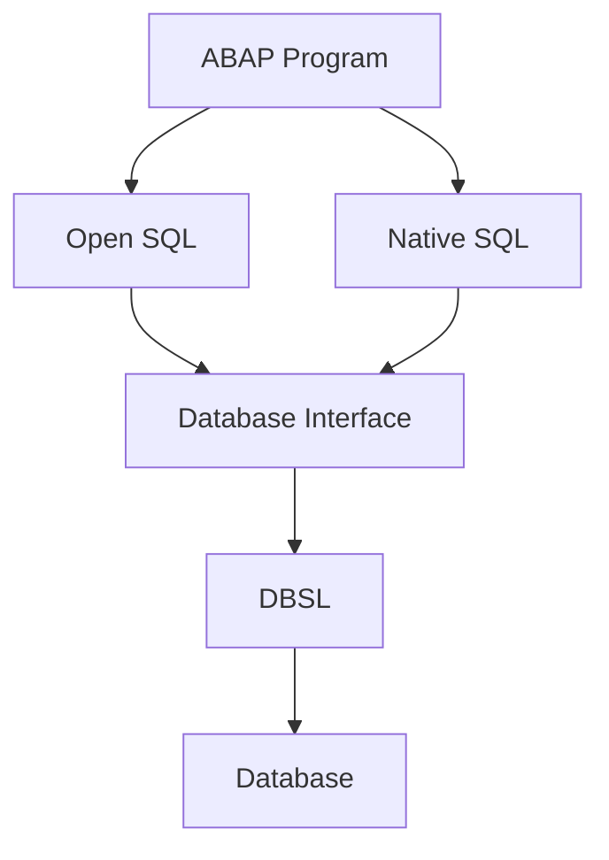

# SAP HANA / OPEN SQL 이론

<details>
<summary><strong>cf. ABAP on HANA 등장 배경</strong></summary>

## 🔴 기존 방식 (Classical ABAP)

```text
[과거] DB → 모든 데이터 → ABAP → 계산

┌───────────────────────────┐
│     Application Layer     │
│          (ABAP)           │
│                           │
│  - LOOP                   │
│  - READ TABLE             │
│  - 계산 로직               │
│  - 집계 / 필터링           │
│                           │
└───────────▲───────────────┘
            │ 모든 데이터
            │ (대량 전송)
┌───────────┴───────────────┐
│      Database Layer       │
│           (DB)            │
│                           │
│  - 데이터 저장             │
│  - 단순 SELECT            │
│                           │
└───────────────────────────┘
```

### 특징
- 데이터베이스는 단순 저장/조회 역할만 수행
- 실제 계산, 집계, 필터링은 대부분 ABAP 애플리케이션 서버에서 수행
- 대량 데이터가 ABAP 서버로 이동하므로 비효율적

---

## 🟢 현재 방식 (ABAP on HANA / New Programming Approach)

```text
[현재] DB(계산 완료) → 결과만 → ABAP

┌───────────────────────────┐
│     Application Layer     │
│          (ABAP)           │
│                           │
│  - 결과 사용               │
│  - UI / 흐름 제어          │
│                           │
└───────────▲───────────────┘
            │ 결과만 전송
            │ (최소 데이터)
┌───────────┴───────────────┐
│      Database Layer       │
│          (HANA)           │
│                           │
│  - 계산 로직               │
│  - 필터링                  │
│  - 집계                    │
│  - JOIN                    │
│  - CDS / SQL / AMDP       │
│                           │
└───────────────────────────┘
```

### 특징
- 계산을 DB(HANA) 쪽으로 밀어 넣는 **Code Push-down** 방식
- ABAP는 결과 소비, UI, 흐름 제어 중심
- 성능 향상과 데이터 전송량 최소화 가능

</details>

---

<details>
<summary><strong>0. Bottom-Up Approach 개요</strong></summary>

## 정의
- **Database(HANA)에서 먼저 모델링**
- 이후 ABAP에서 이를 **소비(consume)** 하는 방식
- **Code Push-down 전략의 실현 방법** 중 하나

```text
HANA (View / Procedure 생성)
          ↓
     ABAP에서 호출
```

## 핵심 포인트
- 먼저 HANA 객체를 만든 뒤
- ABAP에서 해당 객체를 읽거나 호출하는 형태
- 상위 애플리케이션보다 DB 모델링이 먼저라는 점에서 **Bottom-Up**

</details>

---

<details>
<summary><strong>1. Bottom-Up Approach – 초기 방식 (AS ABAP &lt; 7.4 SP02)</strong></summary>

## Figure 32 기준: Direct Access (Native SQL)

### 구조 시각화



### 전체 구조

```text
AS ABAP
 └─ Native SQL로 직접 접근
    ├─ SAP HANA Views
    └─ Stored Procedures

SAP HANA
 ├─ Column Views
 ├─ Stored Procedures
 └─ Delivery Unit
```

### 핵심 특징

| 항목 | 내용 |
|---|---|
| 접근 방식 | Native SQL |
| ABAP 객체 | 없음 (직접 호출) |
| Transport | ABAP CTS와 분리 |
| DB 종속성 | 매우 높음 |
| 재사용성 | 낮음 |

### 문제점
- Native SQL 필수
- DB 독립성 상실
- ABAP Transport와 HANA Transport 이원화
- 유지보수 및 라이프사이클 관리 어려움

### 사용 시점
- ABAP 7.4 SP02 이전
- SAP HANA가 Secondary DB인 경우
- 레거시 시스템

</details>

---

<details>
<summary><strong>2. Bottom-Up Approach – 개선된 방식 (AS ABAP ≥ 7.4 SP02)</strong></summary>

## Figure 33 기준: Proxy Objects 사용

### 핵심 개념
> HANA 객체를 ABAP Repository 안의 Proxy 객체로 감싸서 사용

### 구조 시각화



### 전체 구조

```text
AS ABAP
 ├─ External View
 ├─ Database Procedure Proxy
 └─ SAP HANA Transport Container
        ↑
   expose / transport
        ↓
SAP HANA
 ├─ SAP HANA Views
 ├─ Stored Procedures
 └─ Delivery Unit
```

### 새로 도입된 ABAP 객체

| ABAP 객체 | 역할 |
|---|---|
| External View | HANA Column View를 ABAP Dictionary에서 표현 |
| Database Procedure Proxy | HANA Stored Procedure의 ABAP Proxy |
| SAP HANA Transport Container | ABAP–HANA Transport 동기화 |

### 장점

| 항목 | 개선 내용 |
|---|---|
| SQL 사용 | Native SQL 불필요 |
| DB 독립성 | 향상 |
| Transport | CTS로 통합 관리 |
| 유지보수 | 쉬움 |
| 재사용성 | 높음 |

</details>

---

<details>
<summary><strong>3. Bottom-Up Approach 접근 방식 비교 요약</strong></summary>

| 구분 | Direct Access | Proxy Objects |
|---|---|---|
| ABAP 버전 | &lt; 7.4 SP02 | ≥ 7.4 SP02 |
| SQL 방식 | Native SQL | Open SQL |
| ABAP 객체 | 없음 | External View / Proxy |
| Transport | 분리 | 통합 |
| 권장 여부 | 비권장 | 권장 |

</details>

---

<details>
<summary><strong>4. Transparent Optimizations (기본 최적화 계층)</strong></summary>

## 개념 요약
Transparent Optimizations는 개발자가 코드를 크게 바꾸지 않아도  
DBI(Database Interface)나 실행 엔진 차원에서 성능 최적화 효과를 얻는 계층이다.

### 시각화


### 포인트
- 기존 ABAP 코드 자산을 최대한 유지
- 복잡도는 낮지만 성능 개선 폭은 제한적
- 마이그레이션 초기 단계에서 유용

</details>

---

<details>
<summary><strong>5. Code-to-Data 접근 방법 3가지 비교</strong></summary>

## 시각화

```text
[낮은 복잡도 / 낮은 성능]
Transparent Optimizations
        ↓
Advanced SQL in ABAP
        ↓
SAP HANA Native Features
[높은 복잡도 / 높은 성능]
```

## 비교 표

| 구분 | Transparent Optimizations | Advanced SQL in ABAP | SAP HANA Native Features |
|---|---|---|---|
| 성능 향상 | 낮음 | 중간~높음 | 매우 높음 |
| 코드 복잡도 | 낮음 | 중간 | 높음 |
| DB 종속성 | 없음 | 낮음 | 높음 |
| 유지보수 | 매우 쉬움 | 쉬움 | 어려움 |
| 권장도 | 마이그레이션 초기 | 표준 권장 | 제한적 사용 |

## 해석
- **Transparent Optimizations**: 최소 변경으로 시작
- **Advanced SQL in ABAP**: 실무에서 가장 균형이 좋음
- **SAP HANA Native Features**: 성능은 좋지만 HANA 종속성이 큼

</details>

---

<details>
<summary><strong>6. ABAP 개발 도구 전체 구조 (Figure 37)</strong></summary>

## 핵심 개념
ABAP 개발자는 **두 가지 주요 클라이언트 도구**를 사용한다.

## 전체 아키텍처 구조

```text
Developer
   │
   ├─ Eclipse Client
   │    ├─ SAP HANA Studio
   │    └─ ABAP Development Tools (ADT)
   │         └─ Eclipse Platform
   │              └─ HTTP / RFC
   │                   └─ ABAP Backend (여러 시스템 가능)
   │                        └─ SAP HANA DB 또는 Classic DB
   │
   └─ SAP Logon
        └─ SAP GUI for Windows
             └─ ABAP Backend
```

## Mermaid 시각화



## 도구별 역할 정리

| 구분 | 역할 |
|---|---|
| Eclipse + ADT | 현대적 ABAP 개발 (코드, 객체, 디버깅) |
| SAP HANA Studio | HANA 모델링, DB 객체 관리 |
| SAP GUI for Windows | 전통적 트랜잭션 실행, 관리 작업 |
| ABAP Backend | 실제 ABAP Repository가 존재 |
| Database | SAP HANA 또는 기존 DB |

## 핵심 포인트
- ADT는 **Eclipse 기반**
- 하나의 Eclipse에서 **여러 ABAP 시스템 연결 가능**
- ABAP 시스템은 **HANA DB 또는 Classic DB**일 수 있음

</details>

---

<details>
<summary><strong>7. ABAP Project 개념 (Figure 39)</strong></summary>

## ABAP Project란?
> Eclipse에서 특정 ABAP 시스템 + 사용자에 대한 연결 단위

## ABAP Project가 제공하는 기능

| 기능 | 설명 |
|---|---|
| 시스템 연결 | 특정 ABAP System + User |
| Repository 접근 | 모든 ABAP 개발 객체 |
| 패키지 관리 | 즐겨찾기(Favorite Packages) |
| 개발 단위 | 클래스, 프로그램, 인터페이스 등 |

## Project Explorer 구조

```text
ABAP Project
 ├─ Favorite Packages
 │   ├─ Classes
 │   ├─ Interfaces
 │   ├─ Programs
 │   └─ Function Groups
 │
 └─ Dictionary
     ├─ Tables
     ├─ Views
     └─ Data Elements
```

## Repository 객체 종류

| 객체 유형 | 예 |
|---|---|
| ABAP Class | CL_* |
| Function Pool | ZFG_* |
| Interface | IF_* |
| Program | ZREPORT_* |
| Dictionary | Table, View, Type |

## 실습 메모
- Eclipse 설치 후 ABAP Perspective 선택
- 이클립스에서 `ZHA400_G01` 패키지 생성

</details>

---

<details>
<summary><strong>8. Open SQL, Native SQL, Database Interface, Open SQL의 강화 정리</strong></summary>

## 전체 구조

```text
ABAP Program
   │
   ├─ Open SQL        (DB 독립)
   └─ Native SQL      (DB 종속)
        ↓
Database Interface (DBI)
        ↓
Database-Specific Library (DBSL)
        ↓
Database (HANA, Oracle, DB2 ...)
```

## 시각화



## 용어 정리
- **Open SQL**: ABAP 전용의 DB 독립적인 SQL 인터페이스
- **Native SQL**: 특정 DB의 고유 SQL 문법을 직접 사용
- **DBI(Database Interface)**: ABAP과 실제 DB 사이의 중간 계층

## Open SQL vs Standard SQL vs Native SQL

| 구분 | Open SQL | Standard SQL | Native SQL |
|---|---|---|---|
| 사용 위치 | ABAP | DB 일반 | ABAP |
| DB 독립성 | 높음 | 중간 | 없음 |
| SQL 범위 | 제한적 | 광범위 | DB 전체 |
| DDL / DCL | 불가 | 가능 | 가능 |
| 이식성 | 매우 좋음 | 중간 | 매우 나쁨 |

## Open SQL 제한 사항
- Expressions 사용 제한
- JOIN 종류 제한
- UNION / UNION ALL 미지원
- 서브쿼리, 조건식 등 여러 제약 존재

## Open SQL 진화 단계

```text
SQL-92 Standard
      ▲
Standardized Open SQL   (≥ ABAP 7.5)
      ▲
Enhanced Open SQL       (ABAP 7.4)
      ▲
Open SQL                (Before ABAP 7.4)
```

</details>

---

<details>
<summary><strong>9. New Open SQL Syntax</strong></summary>

## 1) Host Variable 표기: `@` 필수

```abap
" [OLD]
SELECT * FROM sbook
  INTO TABLE it_bookings
  WHERE customid = lv_customer.

" [NEW]
SELECT FROM sbook
  FIELDS *
  WHERE customid = @lv_customer
  INTO TABLE @it_bookings.
```

### 핵심
- ABAP 변수는 `@`로 명확히 표시
- SQL 영역과 ABAP 변수를 구분하기 쉬워짐

---

## 2) INTO 절 위치: SELECT 끝으로 이동

```abap
" [OLD]
SELECT carrid connid fldate
  INTO TABLE it_bookings
  FROM sbook
  WHERE customid = lv_customer
  UP TO 10 ROWS.

" [NEW]
SELECT carrid, connid, fldate
  FROM sbook
  WHERE customid = @lv_customer
  INTO TABLE @it_bookings
  UP TO 10 ROWS.
```

### 핵심
- `INTO` 절이 뒤로 이동하면서 SQL 문장 구조가 더 자연스러워짐

---

## 3) `FIELDS` 키워드 도입

```abap
" [OLD]
SELECT carrid connid fldate
  FROM sbook
  WHERE customid = lv_customer
  INTO TABLE it_bookings.

" [NEW]
SELECT FROM sbook
  FIELDS carrid, connid, fldate
  WHERE customid = @lv_customer
  INTO TABLE @it_bookings.
```

### 핵심
- `FROM` 먼저, `FIELDS`로 필드 명시
- ADT 자동완성과 가독성 측면에서 유리

---

## 4) `UNION / UNION ALL` 지원

```abap
" [OLD]
SELECT id name FROM table_a INTO TABLE @DATA(it_a).
SELECT id name FROM table_b INTO TABLE @DATA(it_b).
APPEND LINES OF it_b TO it_a.

" [NEW]
SELECT FROM table_a
  FIELDS id, name
UNION ALL
SELECT FROM table_b
  FIELDS id, name
INTO TABLE @DATA(it_union).
```

### 핵심
- 예전에는 ABAP 내부 테이블로 합쳐야 했음
- 이제 SQL에서 직접 집합 결합 가능
- `INTO`는 마지막에 한 번만 사용

---

## 5) Expressions(계산식) 지원 강화

```abap
" [OLD]
SELECT carrid loccuram FROM sbook INTO TABLE @DATA(it_old).
LOOP AT it_old ASSIGNING FIELD-SYMBOL(<r>).
  <r>-loccuram = <r>-loccuram * 1.1.
ENDLOOP.

" [NEW]
SELECT FROM sbook
  FIELDS carrid,
         loccuram,
         loccuram * 1.1 AS loccuram_taxed
  INTO TABLE @DATA(it_expr).
```

### 핵심
- 계산을 ABAP가 아니라 DB에서 수행
- **Code Push-down** 대표 예시

---

## 6) `CASE` 지원

```abap
" [OLD]
SELECT carrid smoker FROM sbook INTO TABLE @DATA(it_old_case).
LOOP AT it_old_case ASSIGNING FIELD-SYMBOL(<c>).
  IF <c>-smoker = 'X'.
    " smoker_text = 'SMOKER'
  ELSE.
    " smoker_text = 'NON-SMOKER'
  ENDIF.
ENDLOOP.

" [NEW]
SELECT FROM sbook
  FIELDS carrid,
         smoker,
         CASE
           WHEN smoker = 'X' THEN 'SMOKER'
           ELSE 'NON-SMOKER'
         END AS smoker_text
  INTO TABLE @DATA(it_case).
```

---

## 7) `COALESCE` 지원 (NULL 대체)

```abap
" [OLD]
SELECT carrid order_date fldate FROM sbook INTO TABLE @DATA(it_old_null).
" LOOP 돌며 order_date 비면 fldate로 대체

" [NEW]
SELECT FROM sbook
  FIELDS carrid,
         COALESCE( order_date, fldate ) AS effective_date
  INTO TABLE @DATA(it_coalesce).
```

### 핵심
- NULL 대체값을 DB에서 바로 처리 가능

---

## 8) `CAST` 지원 (타입 변환)

```abap
" [OLD]
SELECT carrid loccuram FROM sbook INTO TABLE @DATA(it_old_cast).
" LOOP에서 타입 변환 처리

" [NEW]
SELECT FROM sbook
  FIELDS carrid,
         CAST( loccuram AS FLTP ) AS amount_flt
  INTO TABLE @DATA(it_cast).
```

---

## 9) 수학 함수 지원

```abap
" [OLD]
SELECT carrid loccuram FROM sbook INTO TABLE @DATA(it_old_math).
" LOOP에서 abs / floor / ceil 처리

" [NEW]
SELECT FROM sbook
  FIELDS carrid,
         ABS( loccuram )    AS abs_amount,
         FLOOR( loccuram )  AS floor_amt,
         CEIL( loccuram )   AS ceil_amt
  INTO TABLE @DATA(it_math).
```

---

## 10) 문자열 결합 `&&` 및 문자열 함수 지원

```abap
" [OLD]
SELECT id name_first name_last FROM scustom INTO TABLE @DATA(it_old_str).
" LOOP에서 CONCATENATE 수행

" [NEW]
SELECT FROM scustom
  FIELDS id,
         name_first && ' ' && name_last AS full_name
  INTO TABLE @DATA(it_concat).
```

```abap
SELECT FROM scustom
  FIELDS id,
         UPPER( name_last )  AS last_upper,
         LOWER( name_first ) AS first_lower,
         LENGTH( name_last ) AS last_len
  INTO TABLE @DATA(it_str_func).
```

---

## 11) `ORDER BY / UP TO / OFFSET` 조합 (페이징)

```abap
" [OLD]
SELECT carrid connid fldate FROM sbook INTO TABLE @DATA(it_old_order).

" [NEW]
SELECT FROM sbook
  FIELDS carrid, connid, fldate
  ORDER BY fldate DESC
  INTO TABLE @DATA(it_page)
  UP TO 20 ROWS
  OFFSET 10.
```

### 핵심
- 정렬, 제한, 오프셋을 DB에서 처리
- 페이지네이션 구현에 유리

---

## New Open SQL 핵심 요약

| 항목 | 변화 |
|---|---|
| Host Variable | `@` 사용 |
| INTO 위치 | 문장 뒤쪽 |
| 필드 명시 | `FIELDS` 사용 |
| 집합 연산 | `UNION / UNION ALL` 가능 |
| 계산식 | Expression 지원 |
| 조건 분기 | `CASE` 지원 |
| NULL 처리 | `COALESCE` 지원 |
| 타입 변환 | `CAST` 지원 |
| 함수 | 수학/문자열 함수 지원 |
| 페이징 | `ORDER BY + UP TO + OFFSET` 가능 |

</details>

---

## 최종 한 줄 정리

> **ABAP on HANA의 핵심은 "데이터를 ABAP로 가져와 계산하는 것"이 아니라, "DB에서 최대한 계산을 끝내고 결과만 가져오는 것"이다.**  
> 그리고 이를 실무에서 가장 대표적으로 구현하는 방식이 **New Open SQL**과 **Code Push-down**이다.
